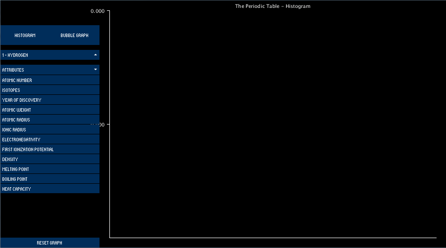

# OOP-2015-2016-Assignment-1

The assignment assigned is to create a visualisation of a dataset using Processing.

The basic requirments of the assignment are:
  - Find a dataset with some data I want to investigate
  - Load the data into a processing scetch
  - Include at least one visualisation that we made in class
  - Include at leat one visualisation I came up with myself
  - Include a menu that allows the user to choose which visualisation to show

The features above are worth 50% of the marks for the assignment.

To get the other 50% I should add advanced features to the program. Such as, but not limited to,
  - Use Control P5 to implement a GUI with controls that allow the user to interact with the visualisations
  - Use classes
  - Display some beautiful animations
  - Do some 3D visualisation
  - Build a custom sensor using an Arduino and visualise its output
  - Visualise some geotagged data on a map
  - Use a Kinect or Leap Motion to interact with the visualisation using gestures
  - Generate the data using Fractals or some other mathematical model

##Deliverables
  - Deliverable 1: Due November 9th. A git repository for my assignment should be created. A Processing sketch should be         created that loads my chosen dataset into some data structure. The readme should include what my project is and waht I       plan to do.
  - Deliverable 2: Due December 7th. This is the final assignment submission, I should have screen-shots of my project and a     writeup of my project in the readme file. Assignment will then be demoed in the following weeks.

## Deliverable 1
  The data set that I have chosen is the perodic table of elements. I chose this because I thought it would be interesting if   all the pieces of data weren't the same type. The main graph I plan to use is bar graphs. I didn't pick it bacause it's the
  easiest to code but that I feel it will show the the large abount of data in the easiest way to read possible. Because of    the large amount of elements in the data set I hope to make it so that you can scroll across the elements, zoom in/out,      select/deselect which elements will be shown, select bars in the graph to get a more in depth view of that specific          element, and possibly more things
  
## Deliverable 2

This is the screen that you see when the program starts. Here you can see an empty graph as nothing has been selected, two buttons for selecting the type of graph you want to display, a reset button to set the graph so no elements get displayed, and two dropdown menus for selecting the elements to be graphed and and what attribute of that element will be graphed.

Here you can see the dropdown menues. The first one for the elements is scrollable as there are a lot of elements that can be chosen from. The second is just a dropdown as there is not as many attributes. The elements can be selected,highlighted red, and deselected.

Here you can see some of the first elements displayed in a histogram. If an element that is selected doesnt have a piece of data for the category being graphed, it will be displayed as a big red bar the height of the graph. The widths of the bars are generated each time an element is added or removed from the graph.

Here is the bubble graph which is similar to the histogram. Howerever semi-transparent bubbles are drawn instead of bars. The size and height of bars is determined by the relative size of the value comepared to the current biggest value.

Here you can see while in the histogram. If you hover over a bar, you eill get all the available information for that bar.
